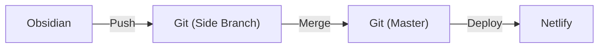

# Workflow Obsidian + Hugo

- #### Start Project
	- Choose a Framework
		- HUGO GO Framework
	- Choose the Publishing Format
		- Digital Gardening
	- Test framework
		- Used Debian version, by apt
		- Inside Docker
	- Format Website
		- Minimalist Blog/Listing Style
		- Chosen Theme PaperMod
	- Push on git
		- GabriOliv / Garden
	- Choose a Deploy Service
		- Netlify

---

- #### Workspace
	- Choose a Editor
		- Set Obsdian 
	- Git automation
		- Obsidian Git Plugin
		- Side branch for "Work In Progress" posts

- #### Ongoing 

---

### Workflow

---