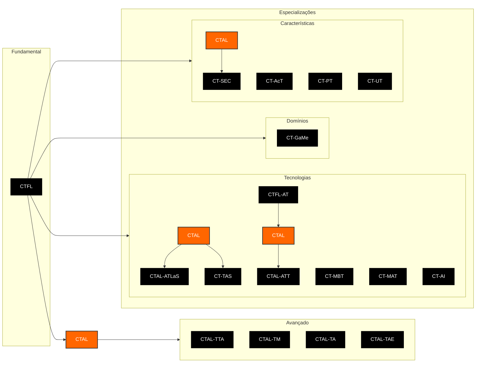

Fluxo atual (`15/09/2024`) de certificações da BSTQB:

```mermaid
	%%{init:{'flowchart':{'useMaxWidth':'true'}}}%%
	flowchart LR

		classDef node fill:#000F,color:#FFFF,stroke:#0000;
		classDef ctal fill:#F60,stroke:#333,stroke-width:2px;
		classDef invisible fill:#0000,stroke:#0000;

		S1:::invisible

		subgraph S0["Fundamental"]
			A[CTFL]
		end

		R1[CTAL]:::ctal

		subgraph S1[" "]
			subgraph S2["Avançado"]
				B[CTAL-TTA]
				C[CTAL-TM]
				D[CTAL-TA]
				E[CTAL-TAE]
			end
			subgraph S3["Especializações"]
				subgraph S4["Tecnologias"]
					R2[CTAL]:::ctal
					R3[CTAL]:::ctal
					F[CTFL-AT]
					G[CTAL-ATT]
					H[CTAL-ATLaS]
					I[CT-TAS]
					J[CT-MBT]
					K[CT-MAT]
					L[CT-AI]
				end
				subgraph S5["Domínios"]
					M[CT-GaMe]
				end
				subgraph S6["Características"]
					R4[CTAL]:::ctal
					N[CT-AcT]
					O[CT-PT]
					P[CT-SEC]
					Q[CT-UT]
				end
			end
		end

		A --> R1 --> S2;
		R2 --> H & I;
		F --> R3 --> G;
		R4 --> P;
		A --> S4 & S5 & S6;
```

---