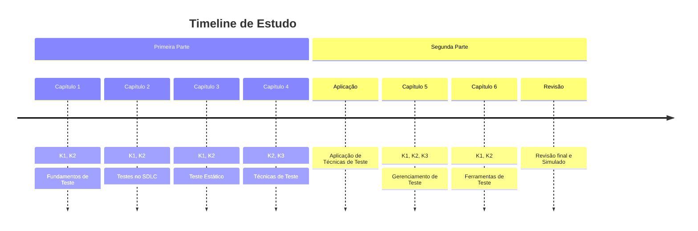

# Certified Tester Foundation Level

CTFL é uma certificação reconhecida internacionalmente para profissionais de qualidade de software e teste de software. É oferecida pela ISTQB (International Software Testing Qualifications Board) e é considerada um padrão básico na indústria de testes de software.
É a primeira certificação da ISTQB e é um pré-requisito para outras certificações mais avançadas, como CTAL e CTAL-TAE. 

A seguir, você encontrará a documentação criada como resumo de estudo para a certificação CTFL.
A única base utilizada para a criação deste material foi o Syllabus da CTFL 4.0, portanto, é recomendado que você consulte o documento oficial para obter informações mais detalhadas.

Consegui a certificação CTFL em 30/08/2024 e resolvi compartilhar o material que criei para estudar.

### Capítulos

- [Capítulo 1: Fundamentos de Teste](./ctfl/ctfl_01)
- [Capítulo 2: Testes no SDLC](./ctfl/ctfl_02)
- [Capítulo 3: Teste Estático](./ctfl/ctfl_03)
- [Capítulo 4: Técnicas de Teste](./ctfl/ctfl_04)
- [Capítulo 5: Gerenciamento de Teste](./ctfl/ctfl_05)
- [Capítulo 6: Ferramentas de Teste](./ctfl/ctfl_06)

### Fluxo de Estudo

- K1: Conhecimento Nível 1 (Lembrança)
- K2: Conhecimento Nível 2 (Compreensão)
- K3: Conhecimento Nível 3 (Aplicação)

### Referências

- Syllabus CTFL 4.0 (BSTQB pt_BR) — Utilizado para a criação deste material;
- Syllabus CTFL 4.0 (ISTQB en) — Documento oficial da ISTQB, utilizado para desambiguação de termos;
- MermaidJS — Utilizado para a criação de diagramas no markdown;
- As demais bibliografias já estão referenciadas adequadamente nos Syllabus.

---