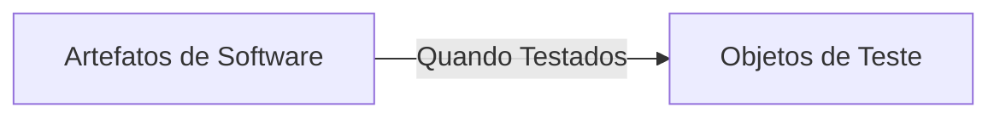
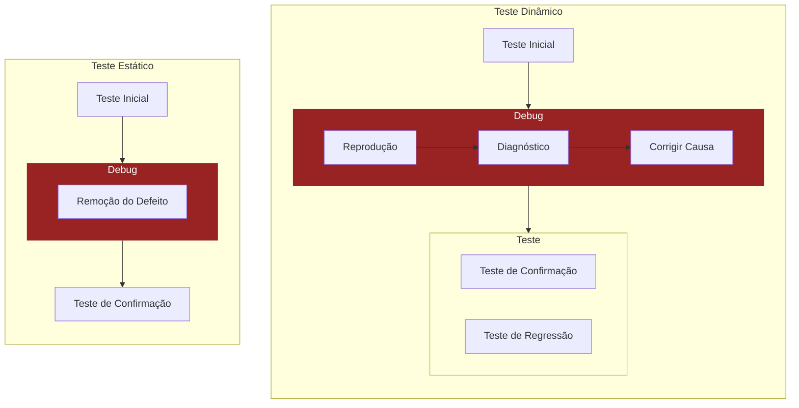
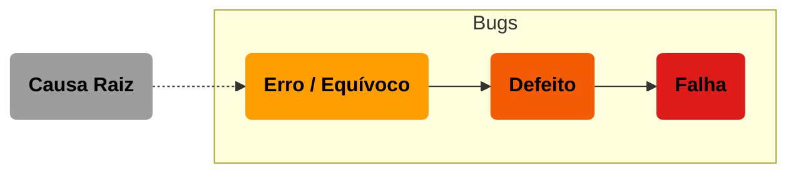

# 1 Fundamentos de Teste

### 1.1 O que é teste

Teste é um conjunto de atividades usadas para descobrir defeitos e avaliar a qualidade do software e seus artefatos.

- Conjunto de atividades usadas para:
	- Descobrir defeitos do software;
	- Avaliar a qualidade dos artefatos do software;
	- Verificar se o sistema atende aos requisitos.

- Tipos de Teste:
	- Estático
		- Análise de Requisitos
	- Dinâmico
		- Execução do Software
		- Diferentes Técnicas

- Teste NÃO É SÓ TÉCNICO, precisa ser:
	- Planejado
	- Gerenciado
	- Estimado
	- Monitorado
	- Controlado

### 1.1.1 Objetivos do Teste

- Objetivos típicos são:
	- Avaliar produtos de trabalho
		- user stories
		- requisitos
		- projetos
		- códigos
	- Detectar falhas
	- Garantir cobertura de um objeto de teste
	- Verificar se os requisitos foram atendidos
	- Verificar conformidade legal ou contratual
	- Fornecer informações para tomada de decisão
	- Validar se o objeto está completo

:::note OBJETIVOS (EM RESUMO):

- DESCOBRIR DEFEITO:
	- NO SOFTWARE
	- NOS REQUISITOS
	- NA COBERTURA
	- NA ENTREGA
	- NAS DECISÕES

:::

Varia de acordo com o contexto da empresa.

### 1.1.2 Teste e Depuração

Depurar = Debugar

DEPURAR/DEBUGAR NÃO É UMA ATIVIDADE DE TESTE

- Reproduzir a falha
- Fazer diagnóstico
- Encontrar a causa raiz

Teste de confirmação é feito posteriormente à alteração de correção;

É realizado pela mesma pessoa que fez o teste inicial.

### 1.2 Por que os testes são NECESSÁRIOS?

Os testes são uma forma de controle de qualidade.

### 1.2.1 Contribuições para o sucesso dos testes

Testes são um meio ECONÔMICO de detectar defeitos.

Ajudam no ciclo de vida do software.

### 1.2.2 Testes e Garantia da Qualidade (QA)

Teste (QC) é diferente de QA.

| | QC | QA |
| :----- | :-----: | :-----: |
| br | Controle de Qualidade | Garantia da Qualidade |
| en| Quality Control | Quality Assurance |
| Método | Corretivo | Preventivo |
| Orientado ao | Produto | Processo |
| Resultado dos testes | Corrigir Defeitos | Feedback do Processo |

### 1.2.3 Erros, Defeitos, Falhas e Causa Raiz

- Humanos cometem ERROS
	- que podem produzir DEFEITOS
		- que podem resultar em FALHAS

Nem todo ERRO gera um DEFEITO, e assim por diante.

Root Causes — Causa Raiz

- Razão fundamental que causou o problema.
- Identificada em Root Cause Analysis (RCA) ou Análise de Causa Raiz.
	- Executada quando uma falha ou defeito é identificado.

Bug — Bug

- Termo geral e informal para se referir aos defeitos do software.

Error — Erro

- Erro (Error) ou Engano (Mistake) são gerados por humanos.
- Podem, ou não, gerar problemas.

Defect — Defeito

- Defeito é a variação entre o esperado (expected) e os resultados atuais.

Failure — Falha

- Consequência da existência de um ou mais defeitos.
- Incapacidade do software de desempenhar a função desejada.

### 1.3 Princípios de Teste

1. O teste mostra a presença, não a ausência de defeitos
	- OU SEJA: nunca haverá a certeza da ausência de bugs.
2. Testes exaustivos são impossíveis
	- OU SEJA: não dá para testar TUDO SEMPRE.
3. Testes antecipados economizam tempo e dinheiro
	- OU SEJA: é mais fácil descobrir e corrigir no começo.
4. Os defeitos se agrupam
	- OU SEJA: se algo está quebrado, vários outros estarão.
5. Os testes se degradam
	- OU SEJA: testar do mesmo jeito não descobre problemas novos.
6. Os testes dependem do contexto
	- OU SEJA: cada problema requer uma heurística.
7. Falácia da ausência de defeitos
	- OU SEJA: piada de ironia do: "Se funciona está correto".

### 1.4 Atividades de teste, Testware e Papéis no teste

"Processo de Teste" é uma forma geral de executar as "Atividades de Teste".

"Testware" é o conjunto de produtos de trabalho de teste.

### 1.4.1 Atividades e Tarefas de Teste

As atividades podem ser executadas em sequência ou em paralelo.

- Planejamento do Teste
	- Definir os objetivos
	- Escolher a abordagem
- Monitoramento e Controle de Teste
	- Verificação contínua das atividades (monitoramento em paralelo)
- Análise de Teste
	- Análise de recursos testáveis
	- Definir prioridades
- Modelagem de Teste
	- Elaborar as condições do teste
	- Identificar como será a Cobertura
	- Ferramentas necessárias
- Implementação do Teste
	- Criação do teste
	- Escrita dos casos ou scripts
- Execução do Teste
	- Executar o teste no sistema
	- Manual ou automatizado
- Conclusão do Teste
	- Arquivar resultados
	- Salvar as análises dos testes realizados

| Atividade | Exemplo |
| :----- | :----- |
| Planejamento | Vamos fazer um teste de carga nessa versão |
| Monitoramento | O teste de carga está seguindo o "Processo de Teste" |
| Análise | Analisar qual tela está mais lenta no sistema |
| Modelagem | O parâmetro para passar é 500 requisições/segundo sem lentidão |
| Implementação | Codificação do teste no k6 |
| Execução | O script de teste de carga é executado no sistema |
| Conclusão | Os resultados são salvos e entregues em um Relatório à gerência |

### 1.4.2 Processo de Teste no Contexto

Testes servem para os stakeholders e esse contexto dita os processos de testes.

- Depende:
	- da ferramenta (manual ou automatizado)
	- do ciclo de vida (scrum ou cascata)
	- do projeto (pouco orçamento, pouco tempo)
	- do domínio de negócio (situação legal, riscos identificados)

### 1.4.3 Testware

Testware é o conjunto de produtos de trabalho de teste.

- Tudo que é gerado pelo trabalho de teste se aplica ao Testware.
	- Relatórios, registros, tabelas, documentação, gráficos...

Todas as Atividades de Teste podem gerar produtos que compõem o Testware.

### 1.4.4 Rastreabilidade entre a Base de Teste e o Testware

O Testware é usado para rastrear o processo de teste.

- "Processo de Teste" gera "Testware"
	- "Testware" gera dados de Cobertura
		- Cobertura é um indicador de objetivo do teste
			- Indicador mede a eficiência do teste

A rastreabilidade da Base do Teste ao Testware também mantém a transparência.

- Facilita a:
	- Avaliação de Cobertura
	- Determinação de impactos das mudanças
	- Informações de qualidade
	- Progresso do projeto

### 1.4.5 Papéis no Teste

Ambos os papéis podem ser executados pela mesma pessoa.

- Gerente de Teste
	- Responsabilidade sobre:
		- Processo de Teste
		- Equipe de Teste
	- Planejamento
	- Monitoramento
- Testador
	- Engenharia técnica do teste
	- Análise
	- Modelagem
	- Implementação
	- Execução

### 1.5 Habilidades essenciais e boas práticas em testes

Algumas habilidades são essenciais, que vão além da aptidão.

### 1.5.1 Habilidades genéricas necessárias para testes

- Conhecimento de teste
- Meticulosidade (Cuidadoso)
- Boa Comunicação
- Pensamento Analítico
- Conhecimento Técnico
- Conhecimento de Domínio

Erros devem ser comunicados de forma construtiva.

### 1.5.2 Abordagem de equipe completa

- Na "Abordagem de Equipe Completa":
	- Qualquer membro pode executar qualquer tarefa
	- Todos são responsáveis pela qualidade
	- A equipe compartilha o mesmo espaço de trabalho
	- Testers colaboram diretamente com outros membros da equipe

### 1.5.3 Independência dos testes

Independência é a separação entre o criador e o testador do produto.
A Independência tem vários níveis.

| Testador | Independência | | Testes Relacionados |
| :----- | :----- | :----- | :----- |
| Próprio Autor | Nulo | 🟥 | Testes de Componente |
| Membro da Equipe | Alguma | 🟥🟧 | Testes de Sistema |
| Membro fora da equipe | Alta | 🟥🟧🟨 | Testes de Integração |
| Membro fora da organização | Muito Alta | 🟥🟧🟨🟩 | Testes de Aceite |

O ideal é que testes sejam realizados em diferentes níveis de Independência.

- Pro: Várias visões de teste.
- Contra: Pode gerar problemas de colaboração.

---