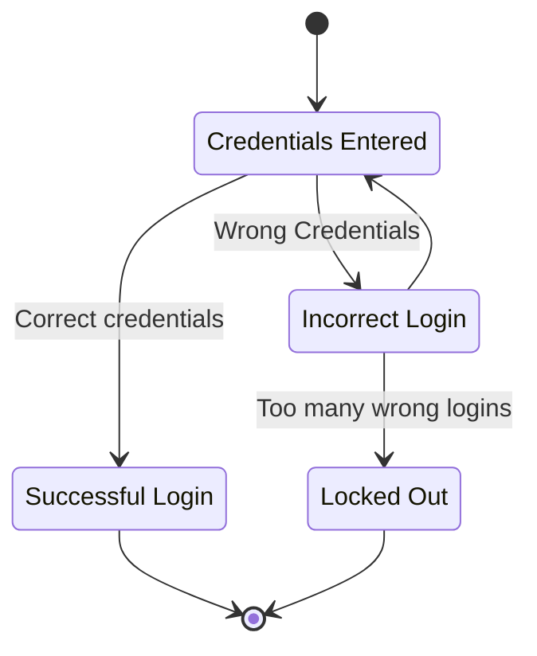

# 4 Análise e Modelagem de Teste

### 4.1 Visão geral das técnicas de teste

- Técnicas de Teste Caixa-Preta
	- Analisam o comportamento do objeto de teste.
- Técnicas de Teste Caixa-Branca
	- Analisam a estrutura interna do objeto de teste.
- Técnicas de Teste Baseada na Experiência
	- Usam o conhecimento e a experiência do testador.

### 4.2 Técnicas de Teste Caixa-Preta

### 4.2.1 Particionamento de Equivalência (EP)

Divide os dados em partes para serem testadas.

Cada partição de dados é agrupada de forma que possa ser testada com o mesmo processo.

- Dados que podem ser agrupados:
	- Input
	- Output
	- Valores Internos
	- Parâmetros de Interface

Compreender como os dados são processados é complicado.

Usar o particionamento com cuidado.

A cobertura é feita validando cada partição com pelo menos um caso de uso.

### 4.2.2 Análise de Valor de Limite (BVA)

BVA (Boundary Value Analysis) se concentra nos valores-limite.

- BVA de 2 Valores: são validados os dois limites da partição:
	- Exemplo: `00-01|10-11|20-21|30-31|`.
- BVA de 3 Valores: são validados os dois limites da partição e seus vizinhos:
	- Exemplo: `00-01|09-10-11|19-20-21|29-30-31|`.

### 4.2.3 Teste de Tabela de Decisão

Usado para testar combinações de requisitos do sistema.

É gerada uma tabela de requisitos em que cada coluna é um requisito e ações associadas.

Age como a "tabela verdade" da lógica computacional.

Na tabela, todas as decisões são desenhadas.

Abordagem sistemática para todas as combinações.

### 4.2.4 Teste de Transição de Estado

Um diagrama de transição de estado modela o comportamento.

Mostra possíveis estados e transições.

- Cobertura:
	- Cobertura de Todos os Estados;
	- Cobertura de Transições Válidas;
	- Cobertura de Todas as Transições.

### 4.3 Técnicas de Teste Caixa-Branca

### 4.3.1 Teste de Instrução e Cobertura de Instrução

- Teste de Instruções;
- Teste de Ramificação.

### 4.3.1 Teste de Instrução e Cobertura de Instrução

Teste de instrução.

Os itens de cobertura são instruções executáveis.

Os casos de teste são instruções no código.

Não detecta casos que dependem de dados.

### 4.3.2 Teste de Ramificação e Cobertura de Ramificação

Usando um grafo de fluxo de controle, cada ramificação é um caso de teste.

As ramificações geralmente são os IFs ou LOOPs.

### 4.3.3 O valor do Teste Caixa-Branca

Usa toda a implementação durante o teste, facilitando a detecção de defeitos de especificação.

Os testes de caixa-branca podem ser usados como teste estático.

### 4.4 Técnicas de Teste Baseadas na Experiência

- Suposição de erro;
- Teste exploratório;
- Teste baseado em lista de verificação.

### 4.4.1 Suposição de Erro

Cria o caso de teste já pensando nos erros possíveis.

São criados com base em erros já experienciados e como o software funcionava anteriormente.

### 4.4.2 Testes Exploratórios

Os testes são modelados, executados e avaliados ao mesmo tempo.

Úteis quando não há conhecimento de como o sistema irá se comportar.

### 4.4.3 Testes baseados em Lista de Verificação

O testador cria uma lista de verificação que será usada como cobertura.

Os itens são formulados em formato de pergunta.

Pode ser usado como um teste de suporte.

### 4.5 Abordagens de Teste Baseadas na Colaboração

Objetivo de EVITAR defeitos.

### 4.5.1 Escrita colaborativa de histórias de usuários

A equipe escreve as User Stories.

Usando "3C":

- Cartão: descrição da história.
- Conversação: como o software será usado.
- Confirmação: critérios de aceite.

### 4.5.2 Critérios de Aceite

Critérios para que os stakeholders aceitem a implementação como completa.

- São usados para:
	- Definir escopo;
	- Chegar a um consenso com stakeholders;
	- Descrever cenários;
	- Base dos Testes de Aceite.
- Podem ser orientados por:
	- Cenários;
	- Regras.

### 4.5.3 Desenvolvimento Orientado por Teste de Aceite (ATDD)

ATDD é uma abordagem que prioriza o teste.

Os casos são criados antes da implementação das User Stories.

---