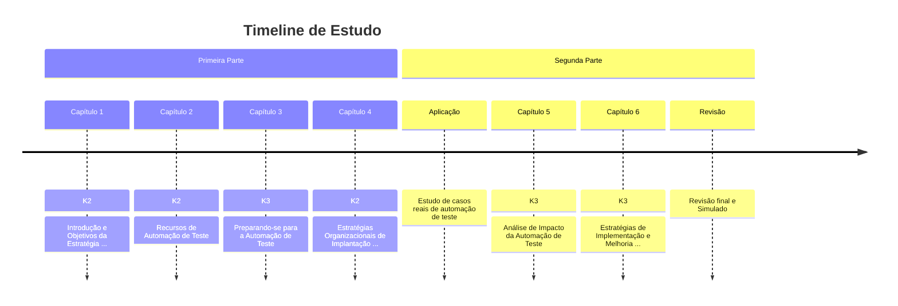

# Certified Tester, Test Automation Strategy

CT-TAS é uma certificação reconhecida internacionalmente para profissionais de qualidade de software e teste de software. É oferecida pela ISTQB (International Software Testing Qualifications Board) e aborda estratégias de automação de testes de software.

A seguir, você encontrará a documentação criada como resumo de estudo para a certificação CT-TAS.
A única base utilizada para a criação deste material foi o Syllabus da CT-TAS 1.0, portanto, é recomendado que você consulte o documento oficial para obter informações mais detalhadas.

Consegui a certificação CT-TAS em 16/12/2024 e resolvi compartilhar o material que criei para estudar.

### Capítulos

- [Capítulo 1: Introdução e Objetivos da Estratégia de Automação de Teste](./cttas/cttas_01)
- [Capítulo 2: Recursos de Automação de Teste](./cttas/cttas_02)
- [Capítulo 3: Preparando-se para a Automação de Teste](./cttas/cttas_03)
- [Capítulo 4: Estratégias Organizacionais de Implantação e Liberação para Automação de Teste](./cttas/cttas_04)
- [Capítulo 5: Análise de Impacto da Automação de Teste](./cttas/cttas_05)
- [Capítulo 6: Estratégias de Implementação e Melhoria para Automação de Teste](./cttas/cttas_06)

### Fluxo de Estudo

- K2: Conhecimento Nível 2 (Compreensão)
- K3: Conhecimento Nível 3 (Aplicação)

### Referências

- Syllabus CT-TAS 1.0 (BSTQB pt_BR) — Utilizado para a criação deste material.
- Syllabus CT-TAS 1.0 (ISTQB en) — Documento oficial da ISTQB, utilizado para desambiguação de termos.
- MermaidJS — Utilizado para a criação de diagramas no markdown.
- As demais bibliografias já estão referenciadas adequadamente nos Syllabus.

---