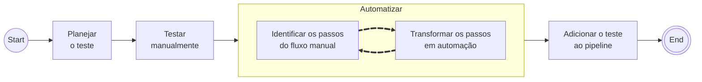

# E2E é Útil?

{frontMatter.description} 

---

## Testes Automatizados E2E

A Definição mais de comum do Teste E2E (end-to-end) é sendo a validação que percorre um fluxo completo de uma aplicação, de "ponta a ponta", simulando o comportamento real do usuário. A ideia principal é testar a aplicação final, com todos os componentes interagindo entre si, clicando automaticamente na tela e validando o caminho que o usuário faria nas telas para ter o resultado esperado, como fazer um login, cadastrar um produto ou finalizar uma compra.

Por ser um teste que junta dois conceitos, interação com interface e validação de fluxo completo, é comum que haja confusão entre testes E2E e outros tipos de testes. Dois tipos comumente confundidos com E2E são os testes de API e testes de componente de interface.

Muitos profissionais colocam os testes de API como parte dos testes E2E, já que a API também é uma interface de interação para requisições e respostas. Mas precisam de ferramentas diferentes (insomnia, postman, etc) e abordagens diferentes (cobrindo os grupos de endpoints e não essencialmente fluxos completos).

Já testes de componente de interface são testes que validam partes isoladas da interface. Renderizando componentes isolados e validando se eles funcionam como esperado, sem considerar o fluxo completo da aplicação. Essa confusão é comum porque muitas das ferramentas usadas para estes testes, como Cypress, também são usadas para testes E2E.

Em algumas literaturas e discussões, Teste de API e Componentes de Interface, são tidos como subcategorias de E2E, mas para evitar confusões entre processos de teste, vamos considerar que estes são categorias separadas. E considerando somente como E2E os testes que validam o fluxo completo da aplicação, do início ao fim de um processo, interagindo com a UI das telas, simulando o usuário.

## Fluxo de Trabalho

Trabalhar com a criação de um teste E2E é parecido com o processo geral de automação de qualquer teste.

1. Planejamento de qual teste será automatizado
2. Realizar o teste manualmente, para entender o fluxo e o que precisa ser validado
3. Transformar os pontos do teste manual em passos automatizados
4. Adicionar o teste a um pipeline de testes adequado

Claro que os passos acima possuem vários subpassos e detalhes, mas o fluxo geral é esse.

Em um teste unitário, o desenvolvedor após terminar a criação de uma função ou método, a executa manualmente com diferentes entradas e saídas, validando se está correta, e depois cria o teste automatizado (unitário) que fará inputs e a validação dos outputs esperados.

No E2E, o tester faz o fluxo completo manualmente, validando como o sistema se comporta, e depois transforma esse fluxo em um teste automatizado. Criando um script que vai interagir com a interface, como ele faria manualmente, e validando se a aplicação se comportou como esperado.

Um ponto importante do fluxo é que o teste manual já precisa estar validado antes da automação, sendo necessário saber quais inputs e outputs são esperados. Se houver alguma dúvida, o teste que acabou de ser automatizado não será tão confiável como deveria ser. E nessa parte que o teste E2E começa a gerar problemas.

Diferente de um teste unitário, que está no começo do processo e é mais fácil e rápido de validar e alterar, já que o desenvolvedor está diante do código. Abrindo possibilidades para outras formas de desenvolvimento como TDD. Já o teste E2E está quase na ponta final do processo e o tester não está viável de alterar o código do software quando algo quebra, precisando retornar a feature para o começo do processo de desenvolvimento para corrigir o erro.

Precisar se valer de um teste manual completo e seguro faz com que o teste E2E imponha uma carga de trabalho maior para o tester, que deve se assegurar da mitigação de todos os bugs das partes do software envolvidas no fluxo com validações manuais antes de criar o teste automatizado sobre um sistema estável.

## Análise de Utilidade

### Pontos Positivos

1. 🛠️ Garantem que o sistema funcione como um todo
	- Testes E2E validam a aplicação do ponto de vista do usuário, cobrindo fluxos completos.
2. 🔄 Detectam regressões reais
	- Quando algo quebra de verdade para o usuário, geralmente é pego por um E2E.
3. 👤 Simulam o comportamento do usuário
	- Eles testam a interface e interações da forma mais próxima da realidade.
4. 🔒 São independentes de implementação interna
	- Não dependem de detalhes de código, o que evita refatorações quebrando os testes.
5. 🚀 Aumentam a confiança nas releases
	- Equipes se sentem mais seguras para lançar código quando há uma suíte E2E robusta.
6. 🔍 Podem ser aproveitados em testes de smoke/regressão automatizados em pipelines CI/CD
	- Servem como linha de defesa final antes do deploy.
7. 🏗️ São úteis em sistemas legados ou de terceiros, onde é difícil testar por dentro
	- Quando não há testes unitários ou de integração suficientes, os E2E ainda conseguem validar o comportamento.
8. 💎 Valem mais por teste do que testes unitários isolados
	- Cobrem vários componentes de uma vez, sendo mais "valiosos" por execução.
9. 🌐 Facilitam testes de acessibilidade, performance e usabilidade em produção
	- Com ferramentas como Cypress ou Playwright, é possível incluir checagens além do “funcionou ou não”.
10. 📋 Ajudam a alinhar QA, Devs e PMs em critérios de aceitação
	 - Servem como documentação viva dos requisitos de negócio.
11. 🐛 Reproduzem cenários de bugs de interface impossíveis de serem reproduzidos humanamente
	 - Como simular dois usuários interagindo ao mesmo tempo na mesma tela.
12. 🌍 Garantem compatibilidade entre navegadores
	- Testam a aplicação em diferentes browsers, assegurando que funcione corretamente em todos eles.
13. 📱 Validam a responsividade da interface
	- Verificam se a aplicação se adapta bem a diferentes tamanhos de tela e dispositivos.
14. 🔥 Ajuda nos smoke tests
	- Validar se a aplicação está rodando e acessível, como um teste de sanidade inicial.

### Pontos Negativos

1. 🐢 Teste E2E tem a execução lenta.
	- Ele simula um usuário real tela a tela, o que consome muito tempo.
2. 💰 São caros de execução.
	- Precisam de toda a aplicação funcionando, muitas vezes com os vários micro-serviços rodando.
3. 🔧 Requerem manutenção constante.
	- Mesmo usando design patterns como Page Object, a manutenção é a mesma de um software separado.
4. 🚨 Alta taxa de falsos negativos.
	- Afetado por erros de timing, ambientes inconsistentes e dependências externas causam muitos falsos alarmes.
5. 🤔 Confusão conceitual.
	- Muitas empresas e equipes propõem fazer testes E2E, mas na prática são testes de integração ou smoke tests.
6. 🚫 Considerar que E2E é o único teste necessário.
	- Dispensando o uso de outros testes, como unitários e de integração.
7. ⏳ Pouco tempo ou maturidade para manter uma suíte E2E robusta.
	- A falta de tempo e recursos pode levar a uma suíte E2E frágil e não confiável.
8. 🛠️ Não pode ser implementado se não houver outros testes abaixo da pirâmide.
	- E2E não substitui testes unitários e de integração, apenas complementa.
9. 👤 Simula a utilização do usuário, mas não substitui a visão do cliente.
	- A visão de alta independência de teste do cliente ainda é necessária.
10. 🖼️ Não são viáveis se não houver padronização de telas.
	 - Se não houver um padrão ou testes de componente de interface, o E2E não será confiável.

> E2E não substitui outras formas de teste. Empresas precisam estar maduras para usar E2E como uma camada complementar de qualidade.

---

## Referências

- Artigos:
	- VOCKE, Ham. Practical Test Pyramid. *martinfowler.com*. Publicado em: 26 fevereiro 2018. Disponível em: [https://martinfowler.com/articles/practical-test-pyramid.html#End-to-endTests](https://martinfowler.com/articles/practical-test-pyramid.html#End-to-endTests). Acesso em: 18 abr. 2025.
		- Descreve a separação entre testes E2E e testes de componentes de interface, e como alguns pensadores da área consideram como uma única abordagem.
	- Cypress. Why Cypress? *Cypress Documentation*. Disponível em: [https://docs.cypress.io/app/get-started/why-cypress#Component-Testing](https://docs.cypress.io/app/get-started/why-cypress#Component-Testing). Acesso em: 18 abr. 2025.
		- Cypress é uma ferramenta de testes E2E que possui uma seção dedicada a implementar testes de componentes de interface.
- Livros:
	- AXELROD, Arnon. *Complete Guide to Test Automation: Techniques, Practices, and Patterns for Building and Maintaining Effective Software Projects*. Apress, 2018. [https://doi.org/10.1007/978-1-4842-3832-5](https://doi.org/10.1007/978-1-4842-3832-5).
		- Aborda o processo e escopos de testes que funcionam melhor ou não com testes E2E.
	- CRISPIN, Lisa; GREGORY, Janet. *Agile Testing: A Practical Guide for Testers and Agile Teams*. Addison-Wesley, 2009.
		- Descreve que testes E2E foram importantes para executar validações automatizadas, mas que não seriam necessários se houvesse cobertura de testes dos componentes do sistema.

---