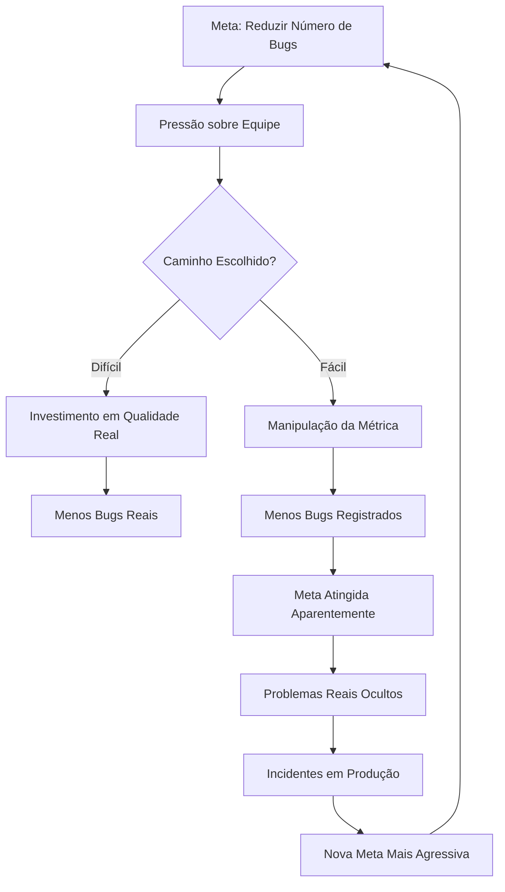

# Metas de Redução de Bugs e o Snake Effect

_Quando a métrica se torna o alvo, o alvo deixa de ser a métrica_

{frontMatter.description}

---

## Resumo

Este artigo investiga o Snake Effect aplicado a políticas de qualidade de software, propondo que metas de redução numérica de bugs incentivam a manipulação da própria métrica ao invés da melhoria real do sistema. A hipótese central sustenta que, quando a métrica vira o alvo, o comportamento organizacional converge para satisfazer o número sem necessariamente resolver o problema subjacente. O fenômeno manifesta-se através de subnotificação, reclassificação de severidade, fragmentação de bugs em tarefas menores e tolerância implícita a defeitos não registrados.

**Palavras-chave:** Snake Effect, incentivo perverso (*perverse incentive*), métricas de qualidade, bugs, Lei de Goodhart

---

## 1. Introdução

Conta-se que, durante o domínio britânico na Índia, o governo colonial ofereceu recompensas por cobras mortas em Delhi. A intenção era reduzir a população de serpentes venenosas. O resultado foi que moradores começaram a criar cobras em cativeiro para matá-las e coletar a recompensa. Quando o governo descobriu e encerrou o programa, os criadores libertaram suas cobras, e a população de serpentes aumentou além do nível original.

A história pode ser apócrifa, mas a dinâmica que descreve é rigorosamente real. Incentivos mal desenhados produzem o oposto do resultado desejado. Na engenharia de software, o equivalente é familiar: estabelecer metas de redução no número de bugs sem calibrar os incentivos adjacentes frequentemente resulta em menos bugs registrados, não em menos bugs existentes.

---

## 2. Revisão de Literatura

### 2.1 O Snake Effect, a Lei de Goodhart e os Incentivos Perversos

Siebert (2001) cunhou o termo Snake Effect (originalmente *Kobra-Effekt*, em alemão) para descrever incentivos mal desenhados que produzem o oposto do resultado desejado. Goodhart (1984) formulou o princípio complementar: "Quando uma medida se torna um alvo, ela deixa de ser uma boa medida."

O conceito de **incentivo perverso** (*perverse incentive*) é a categoria mais ampla na qual o Snake Effect se insere: qualquer estrutura de recompensa que, ao tentar resolver um problema, gera comportamentos contrários ao objetivo original. Kerr (1975), em seu seminal "On the Folly of Rewarding A, While Hoping for B", documentou que sistemas organizacionais frequentemente recompensam um comportamento enquanto esperam outro — e invariavelmente obtêm aquilo que recompensam, não o que desejam.

### 2.2 Métricas e Comportamento Organizacional

Austin (1996), em _Measuring and Managing Performance in Organizations_, demonstrou que medições distorcidas de desempenho produzem disfunção organizacional previsível. Kohn (1993) argumentou que sistemas de recompensa baseados em métricas extrínsecas deterioram motivação intrínseca.

### 2.3 Qualidade de Software e Métricas

Fenton e Bieman (2014) alertaram para os riscos de métricas simplificadas em software. Kitchenham e Pfleeger (1996) detalharam como medições de qualidade de software são susceptíveis a manipulação quando vinculadas a avaliações de desempenho.

---

## 3. Apresentação da Hipótese

**Hipótese central:** Políticas que recompensam exclusivamente a redução no número de bugs registrados incentivam comportamentos de subnotificação, reclassificação e fragmentação, deteriorando a qualidade real enquanto melhoram a métrica aparente.

O Snake Effect no software opera através de múltiplos vetores convergentes.

- Bugs são reclassificados como "melhoria" ou "comportamento esperado".
- Defeitos são corrigidos informalmente sem registro no sistema de tracking.
- QAs aprendem que reportar muitos bugs gera desconforto político.
- A definição de "bug" é estreitada até que apenas problemas inegáveis sejam contabilizados.

---

## 4. Desenvolvimento da Teoria

### 4.1 A Mecânica do Incentivo Perverso (*Perverse Incentive*)

Um **incentivo perverso** (*perverse incentive*) é qualquer recompensa que, ao ser operacionalizada, incentiva comportamentos opostos ao objetivo declarado. No Snake Effect, o incentivo perverso nasce da distância entre o que é medido (número de bugs registrados) e o que se quer alcançar (qualidade real do software).

Quando a meta organizacional é "reduzir bugs em 30%", o sistema social tem duas opções:

O **caminho difícil** consiste em investir em qualidade estrutural, melhorar cobertura de testes, refatorar código frágil e aprimorar processos de design e revisão. O resultado são menos defeitos reais, ao custo de tempo, esforço e recursos significativos.

O **caminho fácil** consiste em ajustar a forma como bugs são registrados, classificados e contados. O resultado são menos bugs na métrica, sem mudança real no sistema.

A pressão de curto prazo favorece o caminho fácil. A racionalização é instantânea: "Isso não é realmente um bug, é uma limitação conhecida." "Essa falha intermitente não é reproduzível, vamos fechar." "Esse problema já existia, não conta para esse ciclo."

### 4.2 Os Canais de Manipulação

O Snake Effect se manifesta em software através de canais sofisticados e frequentemente invisíveis:

A **reclassificação semântica** é o canal mais comum. Bugs são reclassificados como "melhorias", "solicitações de mudança" ou "comportamento por design". O defeito não desaparece, mas muda de categoria contábil.

O **ajuste de severidade** opera de forma mais sutil. Defeitos que seriam classificados como "alto" passam a ser reportados como "médio" ou "baixo", saindo do radar das métricas de qualidade que filtram por severidade.

A **correção informal** representa um canal paradoxal. Desenvolvedores corrigem problemas identificados em conversas informais sem abrir tickets. O defeito é resolvido, mas sua existência não é registrada. Isso pode até melhorar a qualidade pontual, porém elimina rastreabilidade.

O **desestímulo ao reporte** é talvez o canal mais corrosivo. Quando QAs percebem que reportar muitos bugs é mal recebido pela gestão, a taxa de reporte cai, não porque os bugs desapareceram, mas porque a mensagem implícita foi compreendida.

### 4.3 O Paradoxo do Snake Effect

A ironia central é que a meta de qualidade destrói a visibilidade necessária para alcançar qualidade. Ao reduzir o número de bugs registrados, a organização perde a capacidade de diagnosticar onde estão seus problemas reais. O sistema fica às cegas quanto à sua própria saúde.

Organizações que reduzem bugs nas métricas podem estar simultaneamente:

- Acumulando defeitos não rastreados.
- Perdendo informação sobre padrões de falha.
- Desestimulando a cultura de transparência que sustenta qualidade real.

---

## 5. Evidências Observacionais

### 5.1 Dinâmica de Manipulação por Tipo de Meta

| Tipo de Meta | Comportamento Induzido | Resultado na Qualidade |
| :--- | :--- | :--- |
| Reduzir nº de bugs em X% | Subnotificação e reclassificação | Piora oculta |
| Reduzir bugs críticos | Ajuste de severidade para baixo | Piora em criticidade real |
| Zerar bugs abertos | Fechamento prematuro | Reincidência alta |
| Bug count por desenvolvedor | Atribuição cruzada e diluição | Responsabilidade difusa |

### 5.2 Ciclo do Snake Effect em Software

### 5.3 Indicadores de Snake Effect Ativo

Sinais de que a organização está criando cobras ao invés de eliminá-las:

- Número de bugs reportados cai enquanto incidentes em produção permanecem estáveis ou aumentam.
- QAs reportam desconforto em abrir tickets para determinados módulos ou equipes.
- A proporção de bugs classificados como "não é bug" ou "by design" cresce trimestre a trimestre.
- Discussões sobre "o que conta como bug" se tornam frequentes e politizadas.

---

## 6. Contra-argumentos e Limitações

### 6.1 Metas Funcionam quando Bem Desenhadas

Metas de qualidade não são inerentemente disfuncionais. O problema emerge quando a meta é exclusivamente quantitativa e vinculada a incentivos. Metas combinadas (redução de bugs com aumento de cobertura de testes e estabilidade em produção) são significativamente mais resistentes à manipulação.

### 6.2 Nem Toda Reclassificação é Manipulação

Há situações legítimas em que algo reportado como bug é genuinamente um comportamento esperado ou uma solicitação de melhoria. A reclassificação em si não é evidência de Snake Effect; o padrão estatístico de reclassificação é.

### 6.3 Profissionais com Integridade Existem

Muitas equipes não manipulam métricas mesmo sob pressão. O Snake Effect descreve uma tendência sistêmica, não uma certeza individual.

---

## 7. Conclusão

O Snake Effect é uma das demonstrações mais elegantes de como sistemas complexos resistem a intervenções simplistas. No contexto de qualidade de software, a lição é tão clara quanto frequentemente ignorada: medir bugs e recompensar sua redução numérica não melhora a qualidade; melhora a métrica.

A solução não é abandonar métricas, mas reconhecer que qualquer métrica elevada a alvo perde sua função diagnóstica. A qualidade real é multidimensional, resistente a simplificação e avessa a atalhos contábeis. Organizações que compreendem isso medem para aprender, não para punir; e recompensam transparência, não números.

Os britânicos em Delhi queriam menos cobras. Conseguiram mais. Na engenharia de software, queremos menos bugs. Quando medimos errado, conseguimos menos bugs reportados e mais surpresas em produção. As cobras, apesar de tudo, continuam lá.

---

## Referências Bibliográficas

- AUSTIN, R. D. _Measuring and Managing Performance in Organizations_. Dorset House Publishing, 1996.
- FENTON, N. E.; BIEMAN, J. M. _Software Metrics: A Rigorous and Practical Approach_. 3. ed. CRC Press, 2014.
- GOODHART, C. A. E. Problems of monetary management: The UK experience. In: _Monetary Theory and Practice_. Macmillan, 1984. p. 91-121.
- KERR, S. On the folly of rewarding A, while hoping for B. _Academy of Management Journal_, v. 18, n. 4, p. 769-783, 1975.
- KITCHENHAM, B.; PFLEEGER, S. L. Software quality: The elusive target. _IEEE Software_, v. 13, n. 1, p. 12-21, 1996.
- KOHN, A. _Punished by Rewards: The Trouble with Gold Stars, Incentive Plans, A's, Praise, and Other Bribes_. Houghton Mifflin, 1993.
- SIEBERT, H. _Der Kobra-Effekt: Wie man Irrwege der Wirtschaftspolitik vermeidet_. Deutsche Verlags-Anstalt, 2001.
