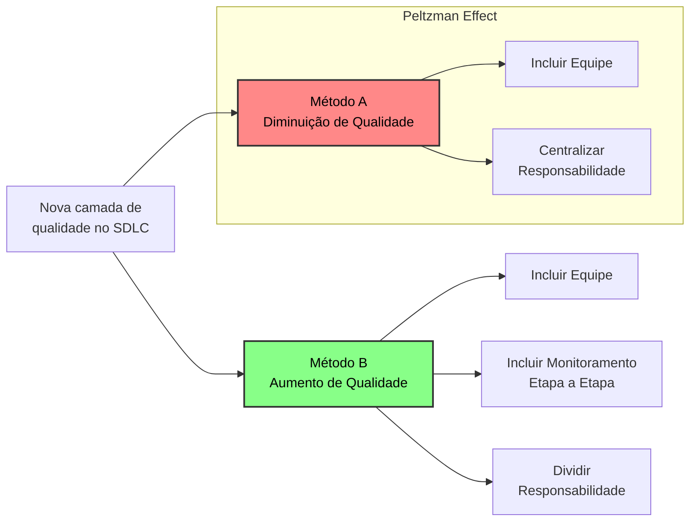

# Efeito Peltzman e a Centralização da Responsabilidade

Incluir uma nova camada de qualidade pode diminuir a qualidade do software?

---

### O Cenário de Implementação

Imagine o cenário em que, uma nova equipe de testers é contratada para realizar uma nova camada de qualidade, testando as novas alterações antes que cheguem em produção. A intenção é garantir que todos os erros sejam identificados antes do cliente e essa responsabilidade agora é transferida para essa nova equipe.

Mas algo inverso acontece, mais erros começam a aparecer em produção, e a gestão não consegue entender porque mais erros estão aparecendo no fluxo de desenvolvimento.
A solução proposta é aumentar o tempo de execução dos testes para garantir que todos sejam mais minuciosos. E agora o tempo de desenvolvimento também está sofrendo atrasos.

Com o tempo, a equipe de testes é desfeita por não conseguir entregar os resultados esperados e a equipe de desenvolvimento recebe novamente a responsabilidade de realizar os próprios testes. O que magicamente diminui o número de erros em produção.

### Análise do Cenário

Implementar uma nova camada de qualidade piorou a qualidade do software porque não faz sentido somente uma equipe ser responsável por garantir a qualidade do software em um fluxo completo e complexo de desenvolvimento.

O que aconteceu foi que, a nova equipe criou uma falsa sensação de segurança em todos os envolvidos no processo de desenvolvimento. Fazendo com que os desenvolvedores acreditassem que não precisavam mais se preocupar com a qualidade como antes, pois agora havia uma equipe dedicada a isso. Essa sensação de segurança levou a um desleixo nas práticas de desenvolvimento  e testes, resultando em mais erros que a equipe focada em qualidade não conseguiu cobrir. Isso é o que chamamos de Efeito Peltzman.

### O Efeito Peltzman

O Efeito Peltzman foi um conceito proposto pelo economista Sam Peltzman no artigo de 1975, "The Effects of Automobile Safety Regulation". O estudo analisou como a introdução de regulamentações de segurança em automóveis levou a um aumento no número de acidentes.

A ideia proposta é que, quando as pessoas se sentem mais seguras devido a regulamentações ou medidas de segurança, elas tendem a adotar comportamentos mais arriscados, diminuindo sua vigilância ou negligenciando as precauções que tomavam anteriormente.

No cenário do desenvolvimento de software, a equipe de testes não pode simplesmente receber toda a responsabilidade pelos erros encontrados em produção, apenas por ser a última camada de segurança. É necessário que dados sejam coletados e analisados para garantir que todos os envolvidos no processo de desenvolvimento mantenham a vigilância e a responsabilidade pela qualidade do software.

Toda alteração feita no fluxo de desenvolvimento deve ser acompanhada de dados que comprovem a eficácia da mudança, etapa por etapa. Isso garante que nenhuma equipe envolvida se sinta excluída da responsabilidade e consequentemente negligencie seu papel na manutenção da qualidade do software.

---

### Mapa Mental

---

### **Referências**

- Artigo de Referência:
	- Peltzman, S. (1975). The Effects of Automobile Safety Regulation. *Journal of Political Economy*, 83(4), 677-725.
		- https://doi.org/10.1086/260352
- Contexto psicológico:
	- **THE DECISION LAB.** The Peltzman Effect. *The Decision Lab*. Disponível em: [https://thedecisionlab.com/reference-guide/psychology/the-peltzman-effect](https://thedecisionlab.com/reference-guide/psychology/the-peltzman-effect). Acesso em: 18 abr. 2025.

---