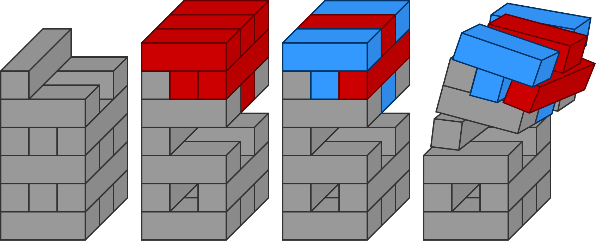

# {frontMatter.title}

{frontMatter.description} 

---

<figure>
  <figcaption class="text--center">
    Jenga ao longo do tempo: o risco de depender de testes manuais em softwares
    "ongoing"
  </figcaption>
  
</figure>

---

## "On Demand" e "Ongoing"

Existe uma diferença estrutural entre projetos de software "on demand" e "ongoing" que muitas equipes só percebem quando o custo de ignorá-la já se tornou alto demais. Projetos "on demand" atendem a uma necessidade pontual: possuem escopo delimitado, ciclo de vida previsível e uma entrega final clara. Projetos "ongoing", por outro lado, são organismos em permanente transformação. Funcionalidades são adicionadas, reescritas, descontinuadas. O software evolui junto com o negócio que sustenta.

Para o primeiro caso, testes manuais podem cumprir seu papel com razoável eficácia. Para o segundo, tornam-se uma armadilha silenciosa que converte o desenvolvimento numa partida interminável de Jenga, onde cada bloco movido pode comprometer a estabilidade de toda a torre.

## Desenvolvendo a Torre de Jenga

A analogia com o Jenga ilumina com precisão o risco de depender de testes manuais em softwares "ongoing". Cada nova funcionalidade equivale a um bloco posicionado no topo da torre, expandindo o sistema sem necessariamente desestabilizá-lo. O perigo real mora nas modificações sobre código existente. Alterar uma funcionalidade já integrada ao sistema equivale a retirar um bloco do meio da estrutura e recolocá-lo em outra posição.

No Jenga físico, o bloco removido deixa uma lacuna. A torre pode permanecer de pé por algum tempo, mas sua integridade está comprometida. No software, essa lacuna representa os potenciais defeitos e regressões que emergem quando se altera código do qual outras partes do sistema dependem. Módulos vizinhos esperavam que aquele bloco estivesse exatamente onde estava, e sua ausência ou deslocamento introduz fragilidades invisíveis para uma análise simples.

Testes manuais equivalem a tentar avaliar a estabilidade da torre apenas observando-a de fora e balançando levemente algumas seções. É um processo lento, impreciso e incapaz de cobrir toda a estrutura a cada movimento. Testes unitários, em contrapartida, funcionam como sensores automáticos instalados em cada junção da torre, detectando qualquer instabilidade no instante em que ela surge. Em questão de segundos, o desenvolvedor sabe se sua alteração comprometeu algo e pode agir antes que a torre desmorone.

A diferença fundamental em relação ao Jenga tradicional é o objetivo. No jogo, o propósito é provocar o colapso na vez do adversário. No desenvolvimento de software, a torre precisa crescer indefinidamente sem jamais cair. Sem testes unitários, cada modificação se transforma num risco existencial para o sistema inteiro.

Testes manuais funcionam enquanto o volume de funcionalidades permanece gerenciável e comedido. Quando o software está em constante mutação, a necessidade de validar toda a regressão a cada alteração cria um gargalo que nenhuma equipe consegue absorver. É nesse ponto que testes unitários deixam de representar uma boa prática opcional e passam a ser uma necessidade estratégica para a sobrevivência do projeto.

## O Exemplo Prático

Considere um sistema de e-commerce que nasceu com escopo enxuto. Possuindo cadastro de produtos, carrinho de compras e checkout. A equipe de três desenvolvedores conseguia testar manualmente todas as funcionalidades em cerca de duas horas antes de cada deploy. Tudo corria bem.

Seis meses depois, o cenário mudou por completo. O sistema passou a contemplar cupons de desconto, programa de fidelidade, múltiplos métodos de pagamento, cálculo de frete com diversas transportadoras, gestão de estoque em tempo real, integração com marketplaces, motor de recomendações e avaliações de produtos. A equipe cresceu para oito desenvolvedores atuando simultaneamente em frentes distintas.

O que antes demandava duas horas de teste manual agora consome dois dias inteiros. E mesmo com esse investimento de tempo, a equipe já não consegue cobrir todos os cenários possíveis. Um desenvolvedor introduz uma nova regra de desconto que interfere no cálculo de frete. Outro ajusta a validação de estoque e, sem perceber, compromete a integração com marketplaces. Um terceiro modifica a API de pagamentos e o sistema de cupons deixa de funcionar corretamente. Cada alteração pode reverberar em múltiplos pontos do sistema, e os testes manuais simplesmente não acompanham essa progressão. Ampliar a equipe de testadores eleva custos e multiplica a complexidade do planejamento, mas não resolve a questão de fundo: garantir que tudo foi validado antes de cada deploy continua sendo uma promessa impossível de cumprir.

## Anatomia do Problema

O teste manual em softwares "ongoing" gera um efeito combinatório que escala de forma impossível de controlar. A cada nova funcionalidade incorporada ao sistema, não basta testá-la isoladamente. É preciso verificar que ela não provocou efeitos colaterais sobre nenhuma das funcionalidades preexistentes. Com N funcionalidades no sistema e uma nova a ser adicionada, a validação deveria cobrir N+1 cenários no mínimo. Essa complexidade só poderia ser atenuada por uma inteligência de teste absolutamente infalível, algo que, na prática, permanece inalcançável por métodos puramente manuais. Quando se consideram as interações cruzadas entre módulos, o número de cenários cresce de forma ainda mais acentuada.

No caso do e-commerce, oito módulos principais geram potencialmente 64 combinações de interação. Acrescentem-se variações de dados, fluxos alternativos e condições de contorno, e o total rapidamente alcança centenas de cenários. Executar tudo isso manualmente antes de cada deploy é inviável. O resultado previsível é que a equipe adote "testes parciais", concentrando-se apenas no que foi modificado e em algumas áreas consideradas críticas.

É precisamente nesse momento que defeitos começam a atravessar as barreiras e chegar à produção. Um desenvolvedor realiza uma alteração aparentemente trivial numa função utilitária compartilhada por quinze módulos. Ele testa manualmente apenas o módulo em que estava trabalhando. Os outros catorze? Presume-se que estejam funcionando. Até que deixam de funcionar. Quando o bug emerge em produção, semanas já se passaram, outros desenvolvedores empilharam alterações por cima, e rastrear a causa raiz se converte numa investigação forense.

## Teste Manual Usado Corretamente

Seria um equívoco defender a eliminação completa dos testes manuais. Eles desempenham um papel insubstituível no ciclo de desenvolvimento: a validação final de requisitos pelos stakeholders. Quando um Product Owner, um cliente ou um usuário final testa manualmente uma funcionalidade, está verificando se o que foi construído atende de fato à necessidade de negócio, se a experiência faz sentido e se o fluxo está alinhado com suas expectativas.

Essa camada de validação humana captura aspectos que nenhum teste automatizado alcança, até agora. Usabilidade, intuitividade, adequação ao contexto real de uso. Um teste unitário pode confirmar que a função de cálculo de desconto retorna o valor correto, mas não avalia se a forma como esse desconto aparece na tela é compreensível para o usuário final. Um teste automatizado pode verificar que o fluxo de checkout funciona tecnicamente, mas não percebe se o processo é confuso ou frustrante.

O problema, portanto, não reside na existência dos testes manuais, mas na sua utilização como mecanismo principal de validação técnica. Quando a equipe de desenvolvimento depende deles para detectar regressões e assegurar que o código não comprometeu funcionalidades existentes, o sistema se torna insustentável. Testes manuais devem ocupar a posição de camada final de validação de negócio, e não a de rede de segurança técnica contra o colapso do sistema.

A abordagem mais robusta combina diferentes níveis de verificação: testes unitários automatizados para validar componentes individuais e prevenir regressões, testes de integração para verificar a comunicação entre módulos e testes manuais para validar requisitos de negócio e experiência do usuário. Cada camada cumpre uma função específica, e nenhuma substitui integralmente as demais. O ponto central é não atribuir aos testes manuais responsabilidades que pertencem à automação.

## Testes Unitários como Rede de Segurança

Testes unitários resolvem o problema ao inverter a lógica de validação. Em vez de submeter o sistema inteiro a verificações manuais após cada mudança, cada componente individual dispõe de testes automatizados que asseguram seu comportamento esperado. Quando um desenvolvedor modifica uma função, os testes de todos os módulos que dependem dela são executados automaticamente em questão de segundos.

No exemplo do e-commerce, cada módulo possuiria seu próprio conjunto de testes. O módulo de descontos cobriria todas as regras de cálculo. O módulo de frete validaria cada transportadora e cenário. Ao alterar a função de cálculo de preço total, 150 testes unitários seriam disparados em 30 segundos, confirmando automaticamente que nenhuma regressão foi introduzida. Se algo quebrou, o desenvolvedor descobre de imediato, enquanto o contexto da alteração ainda está fresco em sua memória.

Testes unitários desempenham também o papel de documentação viva. Um novo integrante da equipe pode ler os testes do módulo de cupons e compreender as regras de negócio envolvidas, os casos especiais e as validações necessárias. Os testes se convertem numa especificação executável que nunca envelhece, porque, caso envelhecesse, falharia.

A adoção de testes unitários deve ser incremental e pragmática. Buscar 100% de cobertura da noite para o dia é irreal e contraproducente. O caminho mais eficaz começa pelas áreas mais críticas e com maior frequência de alteração. Todo código novo deve ser acompanhado de testes. Gradualmente, à medida que manutenções são realizadas em código legado, testes vão sendo incorporados. Em seis meses, a cobertura acumulada transforma a dinâmica de desenvolvimento.

## Escalando com Confiança

Softwares "ongoing" não possuem linha de chegada e precisam evoluir com confiança. Sem isso, o desenvolvimento se torna progressivamente mais lento e arriscado. O receio de quebrar algo existente paralisa a inovação. Desenvolvedores passam a evitar refatorações necessárias sob a lógica de que "se está funcionando, melhor não mexer". A dívida técnica se acumula de forma silenciosa. O intervalo entre a identificação de um bug e sua correção se alonga. A cadência de entrega de novas funcionalidades desacelera. O sistema se converte naquela torre de Jenga colossal onde ninguém deseja ser o responsável pelo desabamento.

Testes automatizados invertem essa dinâmica. Com uma cobertura adequada, refatorar código se torna uma operação segura. Alterar funcionalidades não multiplica exponencialmente o tempo de validação. Defeitos são detectados em minutos, não em dias. A equipe conquista a confiança necessária para promover mudanças ousadas. O tempo investido na escrita de testes é recuperado com folga na etapa de manutenção, porque menos esforço é consumido na correção de regressões e mais energia é direcionada à criação de valor.

## Por Que Testes Unitários São Negligenciados?

Se testes unitários são tão determinantes para a sustentabilidade de softwares "ongoing", o que explica sua baixa adoção? A resposta não está na falta de reconhecimento de sua importância, mas na carência de formação adequada sobre como implementá-los e mantê-los de forma efetiva.

### Ensino sem Foco em Sustentabilidade

A formação em desenvolvimento de software carrega um viés estrutural: ensina a construir, mas raramente ensina a sustentar. Cursos de programação, bootcamps e graduações concentram seus esforços em capacitar o aluno a criar funcionalidades, ou seja, a adicionar blocos no topo da torre de Jenga. Os estudantes aprendem sintaxe, frameworks, padrões de arquitetura e boas práticas de código. Saem prontos para implementar features, integrar APIs e resolver problemas técnicos complexos.

O que permanece ausente da formação é o conhecimento de como garantir que o que foi construído continuará funcionando quando outros desenvolvedores modificarem o código. A distinção entre "fazer funcionar" e "fazer funcionar de forma sustentável" quase nunca é tratada com a profundidade que merece. Quando testes unitários são mencionados, costumam aparecer como recomendação periférica, nunca como componente fundamental da manutenção de software. O resultado são profissionais que sabem criar código, mas não sabem proteger sua longevidade.

### Teoria Sem Manutenção Prática

Os cursos focados em testes unitários incorrem num erro diferente, porém igualmente prejudicial. Ensinam a sintaxe dos frameworks de teste, a estruturação dos cenários e as métricas de cobertura, mas não preparam o desenvolvedor para a situação mais desafiadora e recorrente. Lidar com testes que começam a falhar.

Quando um desenvolvedor modifica código e quinze testes unitários passam a reportar falhas, ele se depara com uma decisão crítica. A falha indica um bug no código recém-alterado ou os testes estão desatualizados? Como distinguir uma regressão legítima de um teste que precisa ser revisado? Como refatorar testes legados que se tornaram opacos e difíceis de manter? Essas questões, que surgem inevitavelmente em projetos reais, raramente integram o currículo de formação.

A consequência é que muitos desenvolvedores, ao se depararem com testes instáveis ou de manutenção custosa, optam por removê-los ou ignorá-los. Não foram preparados para compreender que testes também são código e, como tal, demandam refatoração, otimização e cuidado contínuo. Essa lacuna formativa transforma os testes unitários de aliados em empecilhos, alimentando a percepção equivocada de que "atrapalham mais do que ajudam".

### A Confusão Entre Testes E2E e Testes Unitários

No universo de Quality Assurance, há um movimento compreensível de automatizar verificações manuais por meio de testes end-to-end (E2E). Ferramentas como Selenium, Cypress e Playwright permitem que profissionais de QA automatizem fluxos completos de usuário, reduzindo o esforço manual repetitivo. Trata-se de uma evolução legítima e benéfica para testes de aceitação.

O problema emerge quando essa abordagem é apresentada como equivalente ou substituta dos testes unitários. Testes E2E automatizam a mesma categoria de validação que seria executada manualmente, verificando se o sistema completo funciona do ponto de vista do usuário. São excelentes para validar requisitos de negócio e fluxos críticos, mas inadequados como rede de segurança para o trabalho cotidiano do desenvolvedor.

Testes E2E são lentos na execução, custosos na manutenção, frágeis por dependerem de múltiplos componentes funcionando simultaneamente e difíceis de depurar, já que uma falha não indica com precisão onde está o problema. Quando um desenvolvedor altera uma função e um teste E2E falha dez minutos depois, o contexto imediato da mudança já se dissipou. Quando quinze testes unitários falham em cinco segundos, ele sabe exatamente qual componente foi comprometido.

Testes E2E pertencem, por natureza, à perspectiva do usuário final. Sua vocação é automatizar validações de negócio, e não criar redes de proteção para o desenvolvimento técnico. Quando essa distinção se perde, instala-se uma lacuna em que testes E2E são empregados para resolver um problema de sustentabilidade que somente testes unitários conseguem endereçar de forma adequada.

### Estamos Despreparados para a Realidade

Essa combinação de fatores, formação orientada exclusivamente à construção, ensino de testes desconectado da manutenção prática e confusão entre categorias de teste, produz profissionais tecnicamente competentes porém desaparelhados para a sustentabilidade de longo prazo.

Quando esses profissionais se deparam com a necessidade concreta de testes unitários em projetos "ongoing", não dispõem do repertório prático necessário para implementá-los com eficácia. Tentativas frustradas acabam reforçando a percepção de que "testes unitários são complicados demais" ou "não compensam o esforço".

A superação desse cenário passa por reconhecer que desenvolvimento sustentável constitui uma disciplina distinta do desenvolvimento funcional, com conhecimentos e práticas próprias que precisam ser ensinados de forma explícita. Saber programar não basta. É preciso saber programar de modo que outros possam modificar o código com segurança. Esse é o divisor de águas entre um software que evolui com confiança e um que vive à beira do colapso.

## Como Começar

Se o seu projeto "ongoing" depende predominantemente de testes manuais, o momento de agir é agora. Não aguarde o sistema atingir um tamanho que torne a transição inviável. Comece pela escolha do módulo mais crítico e escreva testes unitários para ele ainda esta semana. Estabeleça a prática de que pull requests devem incluir testes. Documente exemplos claros de como escrever bons testes unitários dentro do contexto do seu projeto.

Para gestores e líderes técnicos, cabe alocar tempo no planejamento para a criação de testes. Essa atividade não é overhead nem trabalho acessório, mas parte indissociável do desenvolvimento. Um desenvolvedor que entrega código sem testes num software "ongoing" não entregou uma funcionalidade completa. Entregou uma bomba-relógio.

A pergunta relevante nunca foi "podemos nos dar ao luxo de escrever testes unitários?", e sim "podemos nos dar ao luxo de não escrevê-los?". Em softwares de evolução contínua, a resposta é inequívoca: testes automatizados são indispensáveis para garantir a sustentabilidade do projeto. A menos que você queira ser o proximo a puxar o bloco de Jenga e ver a torre desabar.

---

## Mapa Mental

- 🏗️ **Tipos de Software**
  - 📦 On Demand
    - Escopo definido
    - Ciclo previsível
  - 🔄 Ongoing
    - Evolução contínua
    - Funcionalidades em crescimento
- ⚠️ **Problema Central**
  - Cada modificação deixa o sistema mais instável
  - Testes manuais não escalam junto com o software
- 🚫 **Limitações dos Testes Manuais**
  - Escala somente com mais testadores
  - Impossível testar todas as combinações
  - Risco de testes parciais
  - Desenvolvimento fica lento e arriscado
- 👥 **Papel dos Testes Manuais**
  - Validação de requisitos de negócio
  - Validação de usabilidade e intuitividade
  - Não deve funcionar como rede de segurança técnica
- ✨ **Solução Testes Unitários**
  - Detecção automática de regressões
  - Validação rápida
  - Documentação viva como especificação executável
  - Possibilita refatoração segura
- 🤔 **Por Que São Negligenciados**
  - Educação com foco em construção, não em sustentabilidade
  - Teoria vs Prática
  - E2E não substitui testes unitários
  - Despreparo para realidade de manutenção contínua
- 🚀 **Implementação Prática**
  - Começar com módulos críticos
  - Cultura nos PRs com testes obrigatórios
  - Investimento de tempo no planejamento
  - Tempo gasto em testes é ganho em manutenção

---

## Referências

- Artigos:
  - NIKOLOVA, Zornitsa. Testing Strategies in an Agile Context. In: _THE FUTURE OF SOFTWARE QUALITY ASSURANCE_. 2020. p. 111-121.
    - [https://doi.org/10.1007/978-3-030-29509-7_9](https://doi.org/10.1007/978-3-030-29509-7_9)
    - Investir em automação é essencial para o sucesso a longo prazo. Testes unitários ajudam o desenvolvedor a receber feedback imediato e os bugs são removidos rapidamente como parte do processo regular de desenvolvimento.
  - VOCKE, Ham. Practical Test Pyramid. _martinfowler.com_. Publicado em: 26 fevereiro 2018. Disponível em: [https://martinfowler.com/articles/practical-test-pyramid.html#End-to-endTests](https://martinfowler.com/articles/practical-test-pyramid.html#End-to-endTests). Acesso em: 26 nov. 2025.
    - Um grande benefício dos testes unitários é que eles servem como uma rede de segurança para alterações de código.
- Livros:
  - CRISPIN, Lisa; GREGORY, Janet. _Agile Testing: A Practical Guide for Testers and Agile Teams_. Addison-Wesley, 2009.
    - Testes manuais não são o bastante para alcançar qualidade de software, pois configura somente um dos quadrantes de teste.
  - ADZIC, Gojko. _Specification by Example: How Successful Teams Deliver the Right Software_. Manning Publications, 2011.
    - Com ciclos de entrega curtos (semanas ou até dias), testes manuais extensivos são impossíveis. Os testes então se acumulam no final de uma iteração e transbordam para a próxima, interrompendo o fluxo. A automação de testes funcionais remove esse gargalo e engaja testadores com desenvolvedores, motivando-os a participar da mudança de processo.
  - MESZAROS, Gerard. _xUnit Test Patterns: Refactoring Test Code_. Addison-Wesley Professional, 2007.
    - Testes manuais são longos e complexos com múltiplas condições devido à sobrecarga envolvida na configuração das pré-condições de cada teste.

---
