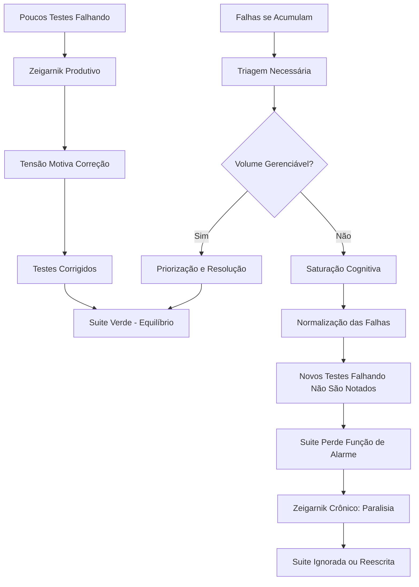

# A Suite de Testes como Artefato Ansiógeno (Zeigarnik Crônico)

_Quando a lista de testes falhando cresce até paralisar quem deveria corrigi-la_

{frontMatter.description}

---

## Resumo

Este artigo investiga como suites de testes com grandes volumes de falhas simultâneas produzem saturação cognitiva e paralisia decisória, interpretando o fenômeno como manifestação crônica do Efeito Zeigarnik. Enquanto a aplicação produtiva do efeito (um ou poucos testes falhando) gera tensão motivacional direcionada, a escala massiva de dezenas ou centenas de testes falhando produz o oposto: sobrecarga que desativa a capacidade de priorização. A hipótese sustenta que existe um limiar além do qual tarefas incompletas deixam de motivar e passam a paralisar.

**Palavras-chave:** Efeito Zeigarnik, sobrecarga cognitiva, paralisia decisória, suites de teste, testes falhando

---

## 1. Introdução

Um teste falhando é um chamado à ação. Dez testes falhando são um problema a ser priorizado. Cem testes falhando são ruído branco. Trezentos testes falhando são paisagem.

O Efeito Zeigarnik, descoberto em 1927, demonstrou que o cérebro humano mantém ativas na memória de trabalho as tarefas não concluídas. Essa tensão cognitiva funciona como motor de resolução: a tarefa aberta demanda fechamento. Contudo, Zeigarnik estudou tarefas individuais em condição controlada. O que acontece quando o volume de tarefas abertas excede a capacidade de processamento?

Na engenharia de software, a resposta é observável em qualquer equipe que herdou uma suite de testes em estado de deterioração: suites com dezenas de testes "permanentemente vermelhos", "temporariamente desabilitados" ou classificados como "conhecidamente instáveis". O sistema cognitivo que deveria manter essas pendências ativas e impulsionar sua resolução simplesmente desliga.

---

## 2. Revisão de Literatura

### 2.1 Efeito Zeigarnik e Seus Limites

Zeigarnik (1927) demonstrou maior retenção mnemônica para tarefas interrompidas. Lewin (1935) interpretou o fenômeno como tensão não resolvida no campo psicológico. Pesquisas subsequentes (Mäntylä & Sgaramella, 1997) indicaram que o efeito diminui sob condições de alta carga cognitiva.

### 2.2 Sobrecarga Cognitiva

Miller (1956) estabeleceu que a memória de trabalho humana opera confortavelmente com 7 (±2) itens simultâneos. Sweller (1988) desenvolveu a teoria da carga cognitiva, demonstrando que excesso de informação reduz capacidade de processamento e aprendizado. Baumeister et al. (1998) documentaram a depleção do ego, onde tarefas decisórias repetidas esgotam recursos de autocontrole.

### 2.3 Paralisia Decisória

Iyengar e Lepper (2000) demonstraram o "paradoxo da escolha": mais opções frequentemente resultam em menos ação. Schwartz (2004) expandiu o conceito, demonstrando que excesso de opções produz ansiedade e postergação.

---

## 3. Apresentação da Hipótese

**Hipótese central:** Suites de testes com falhas massivas simultâneas produzem Zeigarnik Crônico, um estado de sobrecarga cognitiva onde o volume de tarefas incompletas excede a capacidade de priorização e o sistema motivacional inverte-se de ação para paralisação.

O Zeigarnik Crônico se instala sob determinadas condições:

1. Volume de falhas excede a capacidade de triagem individual.
2. Falhas estão presentes há tempo suficiente para normalização.
3. Priorização entre falhas é ambígua ou inexistente.
4. Não há progresso visível de redução do volume.

---

## 4. Desenvolvimento da Teoria

### 4.1 Do Produtivo ao Paralisante

O Efeito Zeigarnik opera num espectro de intensidade que transiciona de produtivo a patológico:

Na **zona produtiva**, com uma a cinco falhas, cada teste falhando é identificável, nomeável e priorizável. A tensão cognitiva é direcionada. O desenvolvedor sabe exatamente o que corrigir primeiro. O ciclo Red-Green opera normalmente.

Na **zona de pressão**, com cinco a vinte falhas, a triagem já requer esforço. A equipe precisa decidir o que corrigir primeiro. A tensão cognitiva ainda é motivacional, mas a necessidade de priorização adiciona carga.

Na **zona de saturação**, com vinte a cinquenta falhas, o volume excede o que pode ser mantido simultaneamente na memória de trabalho. A equipe perde visão do todo. Os testes falhando começam a ser categorizados como "conhecidos" ou "de sempre", normalizando a falha.

Na **zona de paralisia**, com mais de cinquenta falhas, o backlog de falhas torna-se indistinguível de ruído. Novos testes falhando são absorvidos pela massa existente sem gerar alarme. A equipe para de olhar a suite. O artefato de qualidade torna-se paisagem ignorada.

### 4.2 A Normalização da Falha

O fenômeno mais perigoso do Zeigarnik Crônico não é a paralisia em si, mas a normalização que a precede. Quando testes falham cronicamente, a equipe desenvolve mecanismos de adaptação:

A **classificação implícita** é o primeiro mecanismo de adaptação. Testes são mentalmente categorizados como "reais" e "falsos positivos crônicos". A decisão de quais são "reais" é baseada em heurísticas incertas.

A **desabilitação progressiva** segue como consequência. Testes cronicamente falhando são comentados, anotados com `@Ignore`, ou movidos para suites separadas. O ato de desabilitar é apresentado como higiene, mas frequentemente é capitulação.

A **redefinição de verde** é talvez a adaptação mais reveladora. A equipe redefine "suite verde" como "nenhum teste novo falhando", aceitando um baseline de falhas crônicas como a nova normalidade.

A **perda de semântica** é o estágio final. Quando a suite vermelha é o estado padrão, a mudança de verde para vermelho perde significado como sinal de alarme. O indicador mais valioso do sistema de qualidade é neutralizado.

### 4.3 O Ponto de Não-Retorno

Existe um ponto onde a recuperação da suite se torna psicologicamente mais difícil que a reescrita. A equipe olha para 200 testes falhando e calcula que corrigir todos levaria semanas de trabalho sem entrega de funcionalidade. A decisão racional individual é não começar. A decisão coletiva é ignorar.

O paradoxo é claro: a suite de testes, projetada para reduzir ansiedade sobre a qualidade do sistema, torna-se ela mesma fonte primária de ansiedade. O remédio converte-se em sintoma.

---

## 5. Evidências Observacionais

### 5.1 Resposta da Equipe por Volume de Falhas

```
Volume de Falhas  | Resposta Típica           | Estado Cognitivo        | Ação Resultante
-----------------|---------------------------|------------------------|------------------
1-5              | Correção imediata          | Tensão produtiva        | Resolução rápida
5-20             | Triagem e priorização     | Pressão gerenciável     | Resolução planejada
20-50            | Normalização parcial       | Saturação emergente     | Correção seletiva
50-100           | Categorização de falsos+  | Fadiga decisória        | Desabilitação parcial
100+             | Ignorar a suite            | Paralisia ou resignação | Nenhuma ação
```

### 5.2 Transição de Zeigarnik Produtivo para Crônico



### 5.3 Indicadores de Zeigarnik Crônico

- A frase "esses testes sempre falham" é usada sem ironia.
- Sprint reviews mencionam testes falhando como informação de contexto, não como bloqueador.
- Novos membros perguntam "esses testes deveriam passar?" e recebem respostas evasivas.
- O dashboard de CI é visualmente vermelho há semanas sem nenhum ticket aberto para correção.

---

## 6. Contra-argumentos e Limitações

### 6.1 Equipes Disciplinadas Mantêm a Suite

Equipes com práticas maduras de manutenção de testes (zero tolerance para falhas) não experimentam Zeigarnik Crônico. A paralisia é sinal de déficit processual, não inevitabilidade técnica.

### 6.2 Volume Não é o Único Fator

A composição das falhas importa. 50 testes falhando por um único motivo (dependência indisponível) são cognitivamente diferentes de 50 falhas independentes. A heterogeneidade das causas amplifica a paralisia.

### 6.3 Ferramentas Podem Mitigar

Automação de triagem, classificação de falhas por causa raiz e dashboards de tendência podem reduzir a carga cognitiva e prevenir a normalização.

---

## 7. Conclusão

O Efeito Zeigarnik, em sua instância produtiva, é aliado poderoso: o teste falhando que não nos deixa descansar até ser corrigido. Em sua instância crônica, é arma que se vira contra o portador. A suite de testes que deveria proteger o sistema contra falhas torna-se ela mesma um sistema falhando, e sua falha crônica é normalizada, ignorada, e finalmente invisibilizada.

A transição de Zeigarnik Produtivo para Crônico não acontece de uma vez. Acontece um teste ignorado por vez, uma exceção aceita por vez, uma sprint sem correção por vez. Cada uma dessas micro-decisões é localmente racional. Coletivamente, são a morte lenta do sistema de alarme mais valioso que a equipe possui.

A prescrição é infelicitalmente simples e operacionalmente difícil: manter a suite verde. Não permitir acumulação. Tratar cada teste falhando como incidente, não como informação. O custo de manter zero falhas é alto e constante. O custo de não manter é catastroficamente cumulativo. Zeigarnik mostrou que a mente humana quer fechar tarefas abertas, mas também demonstrou, implicitamente, que essa vontade tem limites. Respeitar esses limites é sabedoria de engenharia tanto quanto de psicologia.

---

## Referências Bibliográficas

- BAUMEISTER, R. F.; BRATSLAVSKY, E.; MURAVEN, M.; TICE, D. M. Ego depletion: Is the active self a limited resource? _Journal of Personality and Social Psychology_, v. 74, n. 5, p. 1252-1265, 1998.
- IYENGAR, S. S.; LEPPER, M. R. When choice is demotivating: Can one desire too much of a good thing? _Journal of Personality and Social Psychology_, v. 79, n. 6, p. 995-1006, 2000.
- LEWIN, K. _A Dynamic Theory of Personality_. McGraw-Hill, 1935.
- MÄNTYLÄ, T.; SGARAMELLA, T. Interrupting intentions: Zeigarnik-like effects in prospective memory. _Psychological Research_, v. 60, n. 3, p. 192-197, 1997.
- MILLER, G. A. The magical number seven, plus or minus two: Some limits on our capacity for processing information. _Psychological Review_, v. 63, n. 2, p. 81-97, 1956.
- SCHWARTZ, B. _The Paradox of Choice: Why More is Less_. Ecco, 2004.
- SWELLER, J. Cognitive load during problem solving: Effects on learning. _Cognitive Science_, v. 12, n. 2, p. 257-285, 1988.
- ZEIGARNIK, B. Über das Behalten von erledigten und unerledigten Handlungen. _Psychologische Forschung_, v. 9, p. 1-85, 1927.
