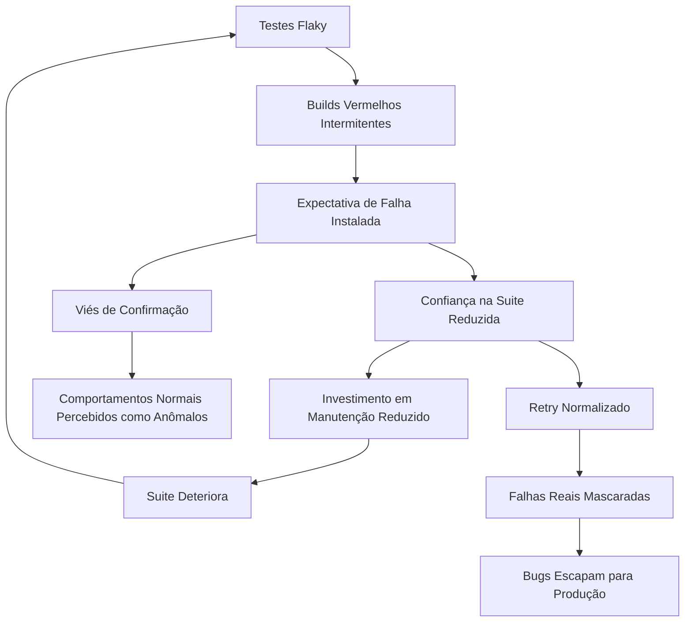

# Testes Flaky como Indutores de Efeito Nocebo Organizacional

_Quando a expectativa de falha se torna a falha_

{frontMatter.description}

---

## Resumo

Este artigo explora a analogia entre o Efeito Nocebo na medicina e o impacto de testes intermitentes (flaky tests) na percepção coletiva de estabilidade de sistemas de software. A hipótese propõe que alta incidência de testes flaky induz um estado de expectativa negativa generalizada na equipe, onde a antecipação de falhas intermitentes amplifica a percepção subjetiva de instabilidade, mesmo em períodos de estabilidade objetiva. O sistema real pode estar saudável, mas a equipe que convive com flakiness crônica perdeu a capacidade de acreditar nisso.

**Palavras-chave:** testes intermitentes, Efeito Nocebo, confiança, estabilidade de software, psicologia organizacional

---

## 1. Introdução

Na medicina, o Efeito Nocebo é o oposto do Efeito Placebo: enquanto o placebo produz melhora através de expectativa positiva, o nocebo produz piora através de expectativa negativa. Pacientes informados de possíveis efeitos colaterais frequentemente experimentam esses efeitos mesmo quando recebem substância inerte. A expectativa cria a realidade.

Na engenharia de software, um fenômeno análogo ocorre em equipes que convivem com testes intermitentes. O teste que falha aleatoriamente uma vez por semana faz mais do que gerar ruído na pipeline. Ele planta uma semente de dúvida que se espalha por toda a percepção do sistema.

Quando o build falha sem motivo aparente, a primeira reação é verificar se algum teste flaky foi o responsável. Mas essa verificação carrega um custo invisível: ela normaliza a expectativa de falha. E uma equipe que espera falhas encontra falhas em todos os lugares, mesmo onde elas não existem.

---

## 2. Revisão de Literatura

### 2.1 O Efeito Nocebo

Benedetti et al. (2007) demonstraram neurologicamente que expectativas negativas ativam vias de ansiedade que amplificam a percepção de dor e desconforto. Colloca e Miller (2011) expandiram a pesquisa para demonstrar que o efeito nocebo é mediado por mecanismos de condicionamento e aprendizado social.

### 2.2 Testes Intermitentes

Luo et al. (2014) realizaram estudo abrangente sobre testes flaky no Google, demonstrando que até 16% das falhas em suites de teste eram intermitentes. Parry et al. (2021) revisaram sistematicamente causas e mitigações, categorizando as fontes de intermitência em dependência de ordem, concorrência, temporização e dependências externas.

### 2.3 Confiança em Sistemas Automatizados

Lee e See (2004) modelaram como a confiança em automação é construída e destruída. A descoberta central é que a confiança degrada-se mais rapidamente por falhas do que se reconstrói por sucessos, o que a faz uma dinâmica assimétrica.

---

## 3. Apresentação da Hipótese

**Hipótese central:** Alta incidência de testes flaky induz Efeito Nocebo organizacional, onde a expectativa coletiva de falha degrada a confiança no sistema além do que a instabilidade real justificaria, gerando um ciclo de desconfiança auto-amplificante.

Entre os mecanismos propostos, destacam-se:

- Exposição repetida a falhas sem causa gera condicionamento negativo.
- A equipe desenvolve viés de confirmação, interpretando comportamentos normais como anômalos.
- O custo cognitivo de distinguir falhas reais de intermitentes erode a confiança na suite como um todo.

---

## 4. Desenvolvimento da Teoria

### 4.1 O Condicionamento Negativo

O condicionamento clássico pavloviano funciona em ambas as direções. Exposição repetida a estímulos negativos (build vermelho) associados a um contexto (a pipeline) gera resposta condicionada de alerta que se ativa mesmo quando o estímulo é benigno.

A equipe que experiencia frequentemente builds vermelhos por causa de testes flaky desenvolve uma associação automática: build vermelho ativa alerta. Com o tempo, o alerta não espera pelo build, ele está sempre ativo em segundo plano. A notificação de "pipeline completed" gera ansiedade antes mesmo de verificar o resultado.

### 4.2 A Erosão da Confiança Binária

O build deveria ser binário: verde significa confiança, vermelho significa problema. Testes flaky destroem essa binariedade, introduzindo um terceiro estado implícito: "provavelmente verde, mas pode ser falso negativo". Esse estado intermediário é cognitivamente custoso porque exige julgamento humano sobre algo que deveria ser automático.

Quando o build falha, a primeira pergunta não é mais "o que quebrou?" mas "é flaky?". Essa triagem consome atenção, e cada instância reforça a mensagem subliminar de que a suite de testes não é confiável. A extensão lógica é devastadora: se a suite que protege o sistema não é confiável, o sistema protegido tampouco merece confiança.

### 4.3 O Ciclo Nocebo

O Efeito Nocebo em testes flaky opera como uma profecia auto-realizável parcial:

1. Testes flaky geram builds vermelhos intermitentes.
2. A equipe desenvolve expectativa de falha.
3. A expectativa de falha reduz a confiança na suite de testes.
4. A baixa confiança reduz o investimento em manutenção da suite.
5. A suite deteriora, gerando mais flakiness.
6. A profecia se confirma: o sistema parece instável, e cada vez mais está.

O elemento nocebo entra no passo 2-3: a confiança cai mais rápido e mais intensamente do que a instabilidade real justificaria, porque a expectativa amplifica a percepção.

### 4.4 O Contágio Perceptivo

O Efeito Nocebo na medicina é socialmente transmissível: pacientes em ambientes onde outros reportam sintomas negativos são mais propensos a reportar os mesmos sintomas. Em equipes de software, a desconfiança com testes flaky se propaga de forma análoga.

Um desenvolvedor sênior que diz "ignora, é flaky" transmite uma mensagem poderosa para toda a equipe: os testes não são confiáveis. Essa mensagem é absorvida e amplificada. Novos membros herdam a desconfiança. A normalização do retry automático ("roda de novo que passa") institucionaliza a expectativa de falha.

---

## 5. Evidências Observacionais

### 5.1 Escala de Impacto

```
Taxa de Flakiness | Comportamento da Equipe         | Confiança na Suite
------------------|----------------------------------|--------------------
< 1%              | Falhas são investigadas          | Alta
1-5%              | "Provavelmente flaky" emerge     | Moderada
5-15%             | Retry automático normalizado     | Baixa
> 15%             | Suite amplamente ignorada        | Mínima
```

### 5.2 Diagrama do Ciclo Nocebo



### 5.3 Sinais de Nocebo Organizacional

- A frase "roda de novo" é usada antes de qualquer investigação.
- A equipe não diferencia entre falha real e intermitente por default.
- Novos membros são instruídos a "ignorar se falhar na primeira vez".
- O tempo entre build vermelho e investigação real é consistentemente longo.
- Há uma sensação difusa de que "o sistema é instável" sem evidência específica recente.

---

## 6. Contra-argumentos e Limitações

### 6.1 Testes Flaky São Problema Técnico Real

A desconfiança gerada por testes flaky não configura nocebo, e sim resposta racional a um problema real. Testes intermitentes genuinamente degradam a utilidade da suite. A comparação com efeito nocebo pode minimizar a gravidade do problema técnico.

### 6.2 A Solução É Técnica, Não Psicológica

Corrigir testes flaky resolve tanto o problema técnico quanto o perceptivo. Invocar modelos psicológicos pode desviar atenção da solução pragmática: menos flakiness, mais confiança.

### 6.3 Resiliência Varia

Equipes diferentes respondem diferentemente a flakiness. Equipes com práticas maduras de quarentena de testes flaky e categorização de falhas podem manter confiança alta apesar de intermitências, invalidando o modelo nocebo universal.

---

## 7. Conclusão

Testes flaky são um problema técnico com solução técnica. O que este artigo adiciona é o reconhecimento de que o custo dos testes flaky excede a soma de suas falhas individuais. Cada intermitência deposita um resíduo de desconfiança na consciência coletiva da equipe, e esse resíduo é mais difícil de limpar do que o teste em si.

O Efeito Nocebo ensina que a expectativa de dano produz dano real, mesmo na ausência do agente causador original. Para equipes de software, a analogia sugere que um teste corrigido não restaura automaticamente a confiança perdida. A reconstrução é assimétrica: destruir confiança é rápido, reconstruí-la é lento.

A implicação prática é que a gestão de testes flaky não é apenas problema de engenharia de testes. É problema de engenharia de confiança. E a confiança, como qualquer praticante de nocebo sabe, vive mais na mente do que na realidade.

---

## Referências Bibliográficas

- BENEDETTI, F. et al. When words are painful: Unraveling the mechanisms of the nocebo effect. _Neuroscience_, v. 147, n. 2, p. 260-271, 2007.
- COLLOCA, L.; MILLER, F. G. The nocebo effect and its relevance for clinical practice. _Psychosomatic Medicine_, v. 73, n. 7, p. 598-603, 2011.
- LEE, J. D.; SEE, K. A. Trust in automation: Designing for appropriate reliance. _Human Factors_, v. 46, n. 1, p. 50-80, 2004.
- LUO, Q. et al. An empirical analysis of flaky tests. _Proceedings of the 22nd ACM SIGSOFT International Symposium on Foundations of Software Engineering_, p. 643-653, 2014.
- PARRY, O. et al. A survey of flaky tests. _ACM Transactions on Software Engineering and Methodology_, v. 31, n. 1, p. 1-47, 2021.
