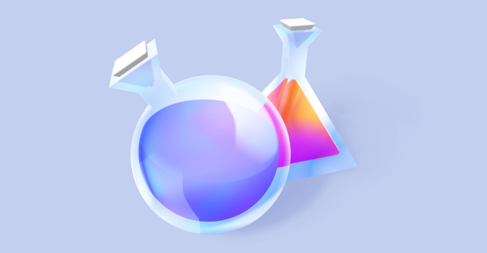

import Columns from '@site/src/components/Columns';
import Column from '@site/src/components/Column';

import Card from '@site/src/components/Card';
import CardBody from '@site/src/components/Card/CardBody';
import CardFooter from '@site/src/components/Card/CardFooter';
import CardHeader from '@site/src/components/Card/CardHeader';
import CardImage from '@site/src/components/Card/CardImage';

import ThemedImage from '@theme/ThemedImage';

import styles from '@site/src/css/styles.module.css';

<!--<h1 style={{textAlign: 'center'}}> Garden </h1>-->

	

		
	

	

		

			

				
			

			

				
			

			

				
			

		

	

---

## Certificações

Resumos de estudo usados para certificações.

<Columns>
	<Column className='padding--md'>
		

			

				

					
				

				

					<h4>CTFL - Certified Tester Foundation Level</h4>
					<small>
						Primeira certificação da ISTQB para a carreira de Teste de Software.
					</small>
				

				

					<a href='/garden/docs/istqb/ctfl'>
						<button className='button button--secondary button--block'>Leia Mais</button>
					</a>
				

			

		

	</Column>
	<Column className='padding--md'>
		

			

				

					
				

				

					<h4>CT-TAS - Test Automation Strategy</h4>
					<small>
						Certificação de Especialização para perspectiva estratégica sobre a automação de testes.
					</small>
				

				

					<a href='/garden/docs/istqb/cttas'>
						<button className='button button--secondary button--block'>Leia Mais</button>
					</a>
				

			

		

	</Column>
	<Column className='padding--md'>
	</Column>
</Columns>

---

## Documentações

Documentações variadas sobre Teste de Software, QA e Computação em geral.

<Columns>
	<Column className='padding--md'>
		

			

				

					
				

				

					<h4>Notes</h4>
					<small>
						Notas sobre QA, Teste ou Computação em geral.
					</small>
				

				

					<a href='/garden/docs/notes'>
						<button className='button button--secondary button--block'>Leia Mais</button>
					</a>
				

			

		

	</Column>
	<Column className='padding--md'>
	</Column>
	<Column className='padding--md'>
	</Column>
</Columns>

---

## Organização por Evolução

Documentação organizada por evolução de aprendizado e revisão.

<Columns>
	<Column className='padding--md'>
		

			

				<h3><code>🌱</code> Iniciais</h3>
			

			

				
Artigos em construção que começam a explorar um tema.

			

			

				<a href='/garden/docs/tags/stageA'>
					<button class="button button--secondary button--block">Veja Todos</button>
				</a>
			

		

	</Column>
	<Column className='padding--md'>
		

			

				<h3><code>🌿</code> Melhorados</h3>
			

			

				
Artigos que foram revisados e melhorados.

			

			

				<a href='/garden/docs/tags/stageB'>
					<button class="button button--secondary button--block">Veja Todos</button>
				</a>
			

		

	</Column>
</Columns>
<Columns>
	<Column className='padding--md'>
		

			

				<h3><code>🌲</code> Intermediários</h3>
			

			

				
Artigos que estão em um nível intermediário de revisão.

			

			

				<a href='/garden/docs/tags/stageC'>
					<button class="button button--secondary button--block">Veja Todos</button>
				</a>
			

		

	</Column>
	<Column className='padding--md'>
		<!--
		

			

				<h3><code>🍎</code> Completos</h3>
			

			

				
Artigos que estão maduros e completos.

			

			

				<a href='/garden/docs/tags/stageD'>
					<button class="button button--secondary button--block">Veja Todos</button>
				</a>
			

		

		-->
	</Column>
</Columns>

---