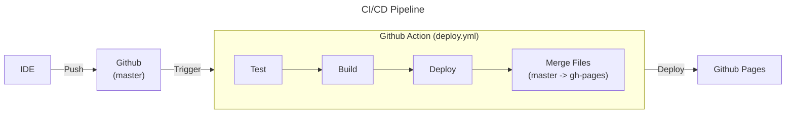

# Getting Started

Primeiros passos para executar o projeto localmente e entender como contribuir.

---

## Estrutura do Projeto

O projeto é construído com a arquitetura JAMStack, usando [Docusaurus](https://docusaurus.io/) como framework de documentação.



## Instalação

### Instalando o Projeto

Clone o repositório:

```bash
git clone git@github.com:GabriOliv/garden.git
```

Entre na pasta do projeto:

```bash
cd garden
```

Instale as dependências:

```bash
npm install
```

Execute o projeto localmente:

```bash
npm start
```

### Build Local

Build do projeto:

```bash
npm run build
```

Server com build:

```bash
npm run serve
```

## Deployment

### Deploy Automático

O deploy é feito automaticamente pelo GitHub Actions, após a aprovação do Pull Request.

- Configuração necessária:
	- Adicionar `gh-pages` como branch de deploy.
	- Adicionar branch `master` como branch protegida.

Projeto será publicado na URL: `USERNAME.github.io/garden`

## Contribuindo

Se você deseja contribuir com o projeto, sinta-se à vontade para abrir um Pull Request ou Issue no repositório com suas sugestões.

## Forking do Projeto

Se você deseja criar um projeto similar, você pode fazer um fork do projeto e adaptar para suas necessidades.

Todo o CI/CD do projeto é feito com o GitHub Actions e o deploy é feito automaticamente para o GitHub Pages. Leia o tópico de [Instalação](#instalação) para mais informações.

Você pode realizar o fork do projeto [AQUI](https://github.com/GabriOliv/garden/fork)

## Licença

O projeto é licenciado sob a licença MIT assim como o Docusaurus.

- A licença do projeto pode ser encontrada no [Repositório do Projeto](https://github.com/GabriOliv/garden/blob/master/LICENSE);
- A licença do Docusaurus pode ser encontrada no [Site Oficial](https://docusaurus.io).

---